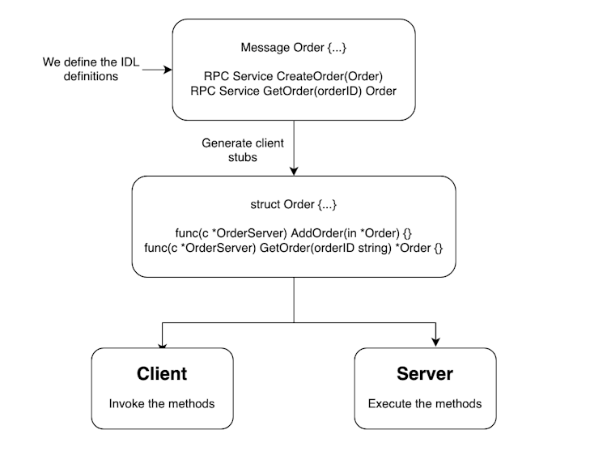
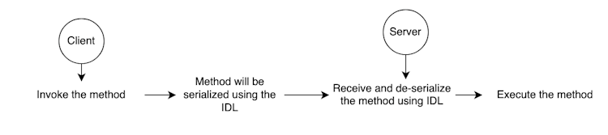

# go-grpc-gateway-example
Build a gRPC API using Go and gRPC-gateway: https://tuts.heomi.net/build-a-grpc-api-using-go-and-grpc-gateway/

# Introduction

[gRPC](https://grpc.io/), developed by Google, is a modern high-performance RPC (Remote Procedure Calls) framework widely used in today’s microservices-oriented landscape. gRPC uses protobufs as its underlying message interchange format and leverages HTTP/2, enabling features such as multiplexing and bi-directional streaming. While gRPC is compatible with various programming languages, Go is particularly prevalent and recognized as the most commonly used and ergonomic option.

# Requirements:

The requirements for the projects are the following:

* Go: any one of the three latest major [releases of Go](https://golang.org/doc/devel/release.html)
* [Protocol Buffer](https://developers.google.com/protocol-buffers) compiler, [version 3](https://protobuf.dev/programming-guides/proto3)


# RPC in a nutshell

RPCs commonly rely on an [IDL](https://en.wikipedia.org/wiki/Interface_description_language), a specification outlining the structure and communication protocols. In the RPC context, payload formats and service definitions are defined using serializable languages like [Protobuf](https://protobuf.dev/)

These definitions are then used to generate corresponding implementations for a specific general-purpose programming language, such as Go, Java, Python, etc. These implementations can then be integrated into an RPC framework like gRPC, enabling us to create a web server and a corresponding client capable of communicating with the created web server.

The below flowchart provides a general idea of what an RPC framework does:



Even though this may seem like magic, under the hood, the communication happens via HTTP, and its abstracted away from the user as below:




# Install protobuf compiler

To compile implementations for the message and definition services that we write in `.proto` files, we need to first have the Protocol Buffer compiler, `protoc`, installed in our system.

In apt-based Linux distributions like Debian and Ubuntu, you can install the compiler by typing:
```bash
$ apt install -y protobuf-compiler
$ protoc --version  # Ensure compiler version is 3+

libprotoc 3.12.4
```

On macOS, using [Homebrew](https://brew.sh/), you can install by typing:
```bash
$ brew install protobuf
$ protoc --version  # Ensure compiler version is 3+
```

# Initialize the Go project

We’ll be using Go modules in our projects, so you can initialize a new Go project using the following commands:
```bash
mkdir go-grpc-gateway-example
cd go-grpc-gateway-example
go mod init github.com/favtuts/go-grpc-gateway-example
```

You should now have a file called `go.mod` in the `go-grpc-gateway-example` directory. Check the Go version defined within. If it has three version components, remove the final component to expand the minimum version for greater compatibility:
```
module github.com/favtuts/go-grpc-gateway-example

go 1.22.4
```

We need to create a directory called `proto` to keep our protobuf file definitions and a another directory called `protogen` to keep our compiled files. It’s good practice to have a dedicated sub directory for each language that you’d like to compile the proto files to, so we’ll create a `golang` subdirectory within the `protogen` directory:
```bash
mkdir -p proto/{orders,product}
mkdir -p protogen/golang
```

Your directory structure should look like this:
```bash
go-grpc-gateway-example
├── go.mod
├── proto
│   ├── orders
│   └── product
└── protogen
    └── golang
```

# Message definitions and code generation

Now, let’s write our first message definition and generate the code for it! 

Create a file called `order.proto` in the `proto/orders` directory with the following contents:
```proto
// ./proto/orders/order.proto

syntax = "proto3";

option go_package = "github.com/favtuts/go-grpc-gateway-example/protogen/golang/orders";

import "product/product.proto";
import "google/api/date.proto";

message Order {
    uint64 order_id = 1 [ json_name = "order_id" ];
    uint64 customer_id = 2 [ json_name = "customer_id" ];
    bool is_active = 3 [ json_name = "is_active" ];
    repeated Product products = 4;
    google.type.Date order_date = 5 [ json_name = "order_date" ];
}
```

Next, create a `product.proto` file in the `proto/product` directory and add the below message definitions:
```proto
// ./proto/product/product.proto

syntax = "proto3";

option go_package = "github.com/favtuts/go-grpc-gateway-example/protogen/golang/product";

enum ProductType {
    UNKNOWN = 0;
    FOOD = 1;
    DRINK = 2;
}

message Product {
    uint64 product_id = 1 [ json_name = "product_id" ];
    string product_name = 2 [ json_name = "product_name" ];
    ProductType product_type = 5 [ json_name = "product_type" ];
}
```


A few observations can be made based on the definitions given above:

* `syntax` refers to the set of rules that define the structure and format for describing protocol buffer message types and services.
* The `go_package` option is used to specify the Go import path for the generated Go language bindings. Hence, the compiled code for `order.proto` will be a file with the path `protogen/golang/orders/order.pb.go`.
* A `message` is a structured unit that represents data. The compiled Go code will be an equivalent `struct` type.
* We specify message fields in the message definition by indicating the data type, field name, and a unique field number assigned to each field. This field number serves as a distinctive identifier, facilitating the processes of serialization and de-serialization. Each data type corresponds to an equivalent Go type. For instance, a `uint64` in Protobuf corresponds to `uint64` in Go.
* Field names in `JSON` can optionally be specified, ensuring that the serialized messages align with the defined field names. For instance, while we employ camel case for our names, gRPC defaults to pascal case.
* We can modularize the definitions by defining them in separate files and importing them as needed. We have created a `Product` definition and have imported it in `Order`.
* Protobuf supports complex types such as arrays defined by the `repeated` keyword, Enums, Unions, and many more.
* Google also provides a number of [custom types](https://github.com/googleapis/googleapis/tree/master/google/type) that are not supported by protobuf out of the box, as seen in the order_date field.


To compile this code we need to copy the [Date definition file](https://github.com/googleapis/googleapis/blob/master/google/type/date.proto) and add it to our project. You can create a folder called `google/api` under the `proto` folder and copy the code under the filename `date.proto`.
```bash
mkdir -p proto/google/api
curl -L https://raw.githubusercontent.com/googleapis/googleapis/master/google/type/date.proto -o proto/google/api/date.proto
```

Now our folder structure looks like this:
```bash
go-grpc-gateway-example
├── go.mod
├── proto
│   ├── google
│   │   └── api
│   │       └── date.proto
│   ├── orders
│   │   ├── order.proto
│   │   └── product.proto
│   └── product
└── protogen
    └── golang
```

Now that we have our definitions, let’s compile the code. 

Before doing so, we need to to install a binary to help the protobuf compiler generate Go-specific code. You can install it in your `GOPATH` using the following command:
```bash
$ go install google.golang.org/protobuf/cmd/protoc-gen-go@latest
$ protoc-gen-go --version
protoc-gen-go v1.34.2
$ which protoc-gen-go
/home/tvt/go/bin/protoc-gen-go
```

Now, create a `Makefile` and add the below line to compile the proto files.
```Makefile
# Makefile

protoc:
	cd proto && protoc --go_out=../protogen/golang --go_opt=paths=source_relative \
	./**/*.proto
```

With this command, we’ve defined the output directory for code generation using the `--go_out` flag. Additionally, we include the `--go_opt` option to specify that Go package paths should align with the directory structure relative to the source directory. The `./**/*.proto` glob expands the current directory and includes all `proto` files for the compilation process.

Run the command by typing:
```bash
$ make protoc
```

It should generate the appropriate code in the `protogen/golang` directory.