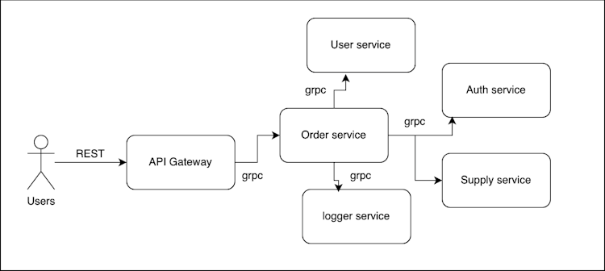
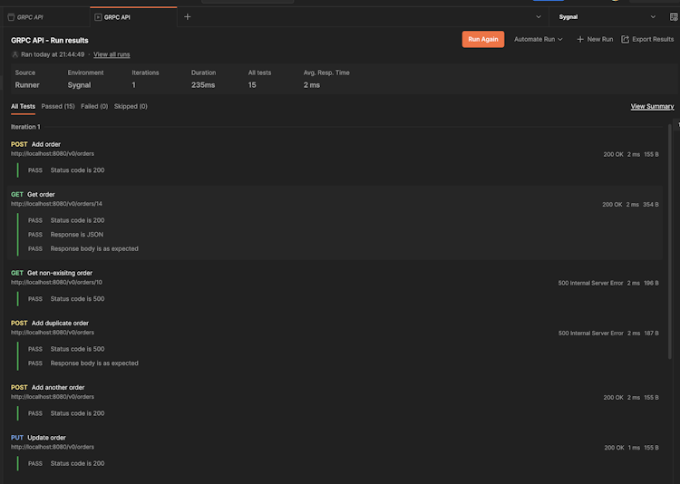

# go-grpc-gateway-example
Build a gRPC API using Go and gRPC-gateway: https://tuts.heomi.net/build-a-grpc-api-using-go-and-grpc-gateway/

# Introduction

[gRPC](https://grpc.io/), developed by Google, is a modern high-performance RPC (Remote Procedure Calls) framework widely used in today’s microservices-oriented landscape. gRPC uses protobufs as its underlying message interchange format and leverages HTTP/2, enabling features such as multiplexing and bi-directional streaming. While gRPC is compatible with various programming languages, Go is particularly prevalent and recognized as the most commonly used and ergonomic option.

# Requirements:

The requirements for the projects are the following:

* Go: any one of the three latest major [releases of Go](https://golang.org/doc/devel/release.html)
* [Protocol Buffer](https://developers.google.com/protocol-buffers) compiler, [version 3](https://protobuf.dev/programming-guides/proto3)


# RPC in a nutshell

RPCs commonly rely on an [IDL](https://en.wikipedia.org/wiki/Interface_description_language), a specification outlining the structure and communication protocols. In the RPC context, payload formats and service definitions are defined using serializable languages like [Protobuf](https://protobuf.dev/)

These definitions are then used to generate corresponding implementations for a specific general-purpose programming language, such as Go, Java, Python, etc. These implementations can then be integrated into an RPC framework like gRPC, enabling us to create a web server and a corresponding client capable of communicating with the created web server.

The below flowchart provides a general idea of what an RPC framework does:


Even though this may seem like magic, under the hood, the communication happens via HTTP, and its abstracted away from the user as below:


# Install protobuf compiler

To compile implementations for the message and definition services that we write in `.proto` files, we need to first have the Protocol Buffer compiler, `protoc`, installed in our system.

In apt-based Linux distributions like Debian and Ubuntu, you can install the compiler by typing:
```bash
$ apt install -y protobuf-compiler
$ protoc --version  # Ensure compiler version is 3+

libprotoc 3.12.4
```

On macOS, using [Homebrew](https://brew.sh/), you can install by typing:
```bash
$ brew install protobuf
$ protoc --version  # Ensure compiler version is 3+
```

# Initialize the Go project

We’ll be using Go modules in our projects, so you can initialize a new Go project using the following commands:
```bash
mkdir go-grpc-gateway-example
cd go-grpc-gateway-example
go mod init github.com/favtuts/go-grpc-gateway-example
```

You should now have a file called `go.mod` in the `go-grpc-gateway-example` directory. Check the Go version defined within. If it has three version components, remove the final component to expand the minimum version for greater compatibility:
```
module github.com/favtuts/go-grpc-gateway-example

go 1.22.4
```

We need to create a directory called `proto` to keep our protobuf file definitions and a another directory called `protogen` to keep our compiled files. It’s good practice to have a dedicated sub directory for each language that you’d like to compile the proto files to, so we’ll create a `golang` subdirectory within the `protogen` directory:
```bash
mkdir -p proto/{orders,product}
mkdir -p protogen/golang
```

Your directory structure should look like this:
```bash
go-grpc-gateway-example
├── go.mod
├── proto
│   ├── orders
│   └── product
└── protogen
    └── golang
```

# Message definitions and code generation

Now, let’s write our first message definition and generate the code for it! 

Create a file called `order.proto` in the `proto/orders` directory with the following contents:
```proto
// ./proto/orders/order.proto

syntax = "proto3";

option go_package = "github.com/favtuts/go-grpc-gateway-example/protogen/golang/orders";

import "product/product.proto";
import "google/api/date.proto";

message Order {
    uint64 order_id = 1 [ json_name = "order_id" ];
    uint64 customer_id = 2 [ json_name = "customer_id" ];
    bool is_active = 3 [ json_name = "is_active" ];
    repeated Product products = 4;
    google.type.Date order_date = 5 [ json_name = "order_date" ];
}
```

Next, create a `product.proto` file in the `proto/product` directory and add the below message definitions:
```proto
// ./proto/product/product.proto

syntax = "proto3";

option go_package = "github.com/favtuts/go-grpc-gateway-example/protogen/golang/product";

enum ProductType {
    UNKNOWN = 0;
    FOOD = 1;
    DRINK = 2;
}

message Product {
    uint64 product_id = 1 [ json_name = "product_id" ];
    string product_name = 2 [ json_name = "product_name" ];
    ProductType product_type = 5 [ json_name = "product_type" ];
}
```


A few observations can be made based on the definitions given above:

* `syntax` refers to the set of rules that define the structure and format for describing protocol buffer message types and services.
* The `go_package` option is used to specify the Go import path for the generated Go language bindings. Hence, the compiled code for `order.proto` will be a file with the path `protogen/golang/orders/order.pb.go`.
* A `message` is a structured unit that represents data. The compiled Go code will be an equivalent `struct` type.
* We specify message fields in the message definition by indicating the data type, field name, and a unique field number assigned to each field. This field number serves as a distinctive identifier, facilitating the processes of serialization and de-serialization. Each data type corresponds to an equivalent Go type. For instance, a `uint64` in Protobuf corresponds to `uint64` in Go.
* Field names in `JSON` can optionally be specified, ensuring that the serialized messages align with the defined field names. For instance, while we employ camel case for our names, gRPC defaults to pascal case.
* We can modularize the definitions by defining them in separate files and importing them as needed. We have created a `Product` definition and have imported it in `Order`.
* Protobuf supports complex types such as arrays defined by the `repeated` keyword, Enums, Unions, and many more.
* Google also provides a number of [custom types](https://github.com/googleapis/googleapis/tree/master/google/type) that are not supported by protobuf out of the box, as seen in the order_date field.


To compile this code we need to copy the [Date definition file](https://github.com/googleapis/googleapis/blob/master/google/type/date.proto) and add it to our project. You can create a folder called `google/api` under the `proto` folder and copy the code under the filename `date.proto`.
```bash
mkdir -p proto/google/api
curl -L https://raw.githubusercontent.com/googleapis/googleapis/master/google/type/date.proto -o proto/google/api/date.proto
```

Now our folder structure looks like this:
```bash
go-grpc-gateway-example
├── go.mod
├── proto
│   ├── google
│   │   └── api
│   │       └── date.proto
│   ├── orders
│   │   ├── order.proto
│   │   └── product.proto
│   └── product
└── protogen
    └── golang
```

Now that we have our definitions, let’s compile the code. 

Before doing so, we need to to install a binary to help the protobuf compiler generate Go-specific code. You can install it in your `GOPATH` using the following command:
```bash
$ go install google.golang.org/protobuf/cmd/protoc-gen-go@latest
$ protoc-gen-go --version
protoc-gen-go v1.34.2
$ which protoc-gen-go
/home/tvt/go/bin/protoc-gen-go
```

Now, create a `Makefile` and add the below line to compile the proto files.
```Makefile
# Makefile

protoc:
	cd proto && protoc --go_out=../protogen/golang --go_opt=paths=source_relative \
	./**/*.proto
```

With this command, we’ve defined the output directory for code generation using the `--go_out` flag. Additionally, we include the `--go_opt` option to specify that Go package paths should align with the directory structure relative to the source directory. The `./**/*.proto` glob expands the current directory and includes all `proto` files for the compilation process.

Run the command by typing:
```bash
$ make protoc
```

It should generate the appropriate code in the `protogen/golang` directory.

If you look at the generated code however, you may notice red squiggly lines in your IDE, indicating that your project lacks some of the expected dependencies. To address this, import the following packages.
```bash
go get google.golang.org/protobuf # Go implementation for protocol buffers
go get google.golang.org/genproto # Contains the generated Go packages for common protocol buffer types
```

Or you can run the command for automatic resolving the dependencies:
```bash
$ go mod tidy
```

Let’s write some code to see the generated Order struct in action. Create a temporary `main.go` file in the root directory with the following code:
```go
// main.go

package main

import (
	"fmt"
	"log"

	"google.golang.org/genproto/googleapis/type/date"
	"google.golang.org/protobuf/encoding/protojson"

	"github.com/favtuts/go-grpc-gateway-example/protogen/golang/orders"
	"github.com/favtuts/go-grpc-gateway-example/protogen/golang/product"
)

func main() {
	orderItem := orders.Order{
		OrderId:    10,
		CustomerId: 11,
		IsActive:   true,
		OrderDate:  &date.Date{Year: 2021, Month: 1, Day: 1},
		Products: []*product.Product{
			{ProductId: 1, ProductName: "CocaCola", ProductType: product.ProductType_DRINK},
		},
	}

	bytes, err := protojson.Marshal(&orderItem)
	if err != nil {
		log.Fatal("deserialization error:", err)
	}

	fmt.Println(string(bytes))
}
```

The created order-item will be serialized to JSON using the `protojson` package.
```bash
go get google.golang.org/protobuf/encoding/protojson
```

You can run the code by typing:
```bash
$ go run main.go

{"order_id":"10", "customer_id":"11", "is_active":true, "products":[{"product_id":"1", "product_name":"CocaCola", "product_type":"DRINK"}], "order_date":{"year":2024, "month":9, "day":19}}
```

Note that, gRPC will typically serialize the messages in binary format, which is faster and takes less space compared to a text format like JSON.

As this was only for testing, you can remove the `main.go` file when you are finished:
```bash
rm main.go
```

# Service definitions and code generation

We’ve looked at how to create message/payload definitions using protobuf. Now, let’s add the service (endpoints in REST) definitions to register in our gRPC server.

Open the `order.proto` file in the `proto/orders` directory again and add the following definitions to the end of the file:
```proto
// ./proto/orders/order.proto

. . .

// A generic empty message that you can re-use to avoid defining duplicated
// empty messages in your APIs
message Empty {}

message PayloadWithSingleOrder {
  Order order = 1;
}

service Orders {
  rpc AddOrder(PayloadWithSingleOrder) returns (Empty) {}
}
```

Here, we’ve added a service definition to add a new order. It takes a payload with single order as an argument and returns an empty body.

To compile this service definition, it is important to have a gRPC-specific binary installed. You can be install it with the following command:
```bash
$ go install google.golang.org/grpc/cmd/protoc-gen-go-grpc@latest
$ protoc-gen-go-grpc --version

protoc-gen-go-grpc 1.5.1
```

Let’s modify the `protoc` command in our `Makefile` to generate gRPC code as well.
```Makefile
# Makefile

protoc:
	cd proto && protoc --go_out=../protogen/golang --go_opt=paths=source_relative \
	--go-grpc_out=../protogen/golang --go-grpc_opt=paths=source_relative \
	./**/*.proto
```

We have added two new arguments with `--go-grpc_out` and `--go-grpc_opt`.

Run protoc target again:
```bash
make protoc
```

The output should now include a file with the path `protogen/golang/orders/order_grpc.pb.go`.

To make the generated code work in our system we need to install the following gRPC dependency:
```bash
go get google.golang.org/grpc
```

# Service implementation

If you look at the generated gRPC code in the `protogen/golang/orders/order_grpc.pb.go` file, you’ll see the below interface defined.
```go
// ./protogen/golang/orders/order_grpc.pb.go

. . .
// OrdersClient is the client API for Orders service.
//
// For semantics around ctx use and closing/ending streaming RPCs, please refer to https://pkg.go.dev/google.golang.org/grpc/?tab=doc#ClientConn.NewStream.
type OrdersClient interface {
	AddOrder(ctx context.Context, in *PayloadWithSingleOrder, opts ...grpc.CallOption) (*Empty, error)
}
. . .
```

Our goal in this section is to create a structure which implements this interface and wire it up with a new gRPC server. We’ll use the necessary file structure:
```bash
go-grpc-gateway-example
├── cmd
│   └── server
│       └── main.go
├── go.mod
├── go.sum
├── internal
│   ├── db.go
│   └── orderservice.go
├── Makefile
├── proto
│   ├── google
│   │   └── api
│   │       └── date.proto
│   ├── orders
│   │   └── order.proto
│   └── product
│       └── product.proto
└── protogen
    └── . . .
```

To create the missing directories and files, type:
```bash
mkdir -p cmd/server internal
touch cmd/server/main.go internal/{db,orderservice}.go
```

Next, open the `internal/orderservice.go` file and paste in the following contents:
```go
// ./internal/orderservice.go

package internal

import (
	"context"
	"log"

	"github.com/favtuts/go-grpc-gateway-example/protogen/golang/orders"
)

// OrderService should implement the OrdersServer interface generated from grpc.
//
// UnimplementedOrdersServer must be embedded to have forwarded compatible implementations.
type OrderService struct {
	db *DB
	orders.UnimplementedOrdersServer
}

// NewOrderService creates a new OrderService
func NewOrderService(db *DB) OrderService {
	return OrderService{db: db}
}

// AddOrder implements the AddOrder method of the grpc OrdersServer interface to add a new order
func (o *OrderService) AddOrder(_ context.Context, req *orders.PayloadWithSingleOrder) (*orders.Empty, error) {
	log.Printf("Received an add-order request")

	err := o.db.AddOrder(req.GetOrder())

	return &orders.Empty{}, err
}
```

The above code creates a `struct` called `OrderService` to implement the gRPC interface and we have added the same method signature as given in the interface definition for the `AddOrder` method. This method accepts an order from the request, stores it in a database, and returns an empty message along with any associated errors.

We can create a mock version of an in-memory database using an array to illustrate that we can utilize databases and other services exactly the same way as we would in a REST environment.

Place the following in the `internal/db.go` file:
```go
// ./internal/db.go
package internal

import (
	"fmt"

	"github.com/favtuts/go-grpc-gateway-example/protogen/golang/orders"
)

type DB struct {
	collection []*orders.Order
}

// NewDB creates a new array to mimic the behaviour of a in-memory database
func NewDB() *DB {
	return &DB{
		collection: make([]*orders.Order, 0),
	}
}

// AddOrder adds a new order to the DB collection. Returns an error on duplicate ids
func (d *DB) AddOrder(order *orders.Order) error {
	for _, o := range d.collection {
		if o.OrderId == order.OrderId {
			return fmt.Errorf("duplicate order id: %d", order.GetOrderId())
		}
	}
	d.collection = append(d.collection, order)
	return nil
}
```

Let’s create the gRPC server and see if we can register the `OrderService` that we have created above.

Add the following to the `cmd/server/main.go` file:
```go
// ./cmd/server/main.go

package main

import (
	"log"
	"net"

	"github.com/favtuts/go-grpc-gateway-example/internal"
	"github.com/favtuts/go-grpc-gateway-example/protogen/golang/orders"
	"google.golang.org/grpc"
)

func main() {
	const addr = "0.0.0.0:50051"

	// create a TCP listener on the specified port
	listener, err := net.Listen("tcp", addr)
	if err != nil {
		log.Fatalf("failed to listen: %v", err)
	}

	// create a gRPC server instance
	server := grpc.NewServer()

	// create a order service instance with a reference to the db
	db := internal.NewDB()
	orderService := internal.NewOrderService(db)

	// register the order service with the grpc server
	orders.RegisterOrdersServer(server, &orderService)

	// start listening to requests
	log.Printf("server listening at %v", listener.Addr())
	if err = server.Serve(listener); err != nil {
		log.Fatalf("failed to serve: %v", err)
	}
}
```

The code above starts a gRPC server listening on port `50051` using the mock database we created. You can run it by typing:
```bash
go run cmd/server/main.go
```

After compilation, the server will start. This means that you have successfully created a service definition, generated the corresponding code, implemented a service based on those definitions, registered the service, and initialized a gRPC server!

Though the server is running, you can confirm that the server doesn’t respond to HTTP requests by making a request with curl:
```bash
$ curl 127.0.0.1:50051

curl: (1) Received HTTP/0.9 when not allowed
```
Unfortunately, it’s not easy to test a gRPC server like a REST server by using tools like browsers, Postman, or curl.

While there are tools available for testing gRPC servers, we’ll instead create an API gateway server to demonstrate how we can invoke methods in a manner similar to the REST paradigm.

# Set up the API Gateway

Reasons for using an API Gateway can range from maintaining backward-compatibility, supporting languages or clients that are not well-supported by gRPC, or simply maintaining the aesthetics and tooling associated with a RESTful JSON architecture.

The diagram below shows one way that REST and gRPC can co-exist in the same system:



Fortunately for our purposes, Google has a library called [grpc-gateway](https://github.com/grpc-ecosystem/grpc-gateway) that we can use to simplify the process of setting up a reverse proxy. It will act as a HTTP+JSON interface to the gRPC service. All that we need is a small amount of configuration to attach HTTP semantics to the service and it will be able to generate the necessary code.

To help generate the gateway code, we require two additional binaries:
```bash
go get github.com/grpc-ecosystem/grpc-gateway/v2/protoc-gen-grpc-gateway
go get github.com/grpc-ecosystem/grpc-gateway/v2/protoc-gen-openapiv2
go install github.com/grpc-ecosystem/grpc-gateway/v2/protoc-gen-grpc-gateway
go install github.com/grpc-ecosystem/grpc-gateway/v2/protoc-gen-openapiv2
```

As mentioned above, we need to make a few small adjustments to our service definition to make this work. But before we do that, we need to add two new files into our `proto/google/api` folder, namely [annotations.proto](https://github.com/googleapis/googleapis/blob/master/google/api/annotations.proto) and [http.proto](https://github.com/googleapis/googleapis/blob/master/google/api/http.proto):

```bash
curl -L https://raw.githubusercontent.com/googleapis/googleapis/master/google/api/annotations.proto -o proto/google/api/annotations.proto
curl -L https://raw.githubusercontent.com/googleapis/googleapis/master/google/api/http.proto -o proto/google/api/http.proto
```

The proto directory should now look like this:
```bash
go-grpc-gateway-example/proto
├── google
│   └── api
│       ├── annotations.proto
│       ├── date.proto
│       └── http.proto
├── orders
│   └── order.proto
└── product
    └── product.proto
```

Next modify the `proto/orders/orders.proto` file to add the gateway server changes. The new contents look like this:
```proto
// ./proto/orders/orders.proto

syntax = "proto3";

option go_package = "github.com/favtuts/go-grpc-gateway-example/protogen/golang/orders";

import "product/product.proto";
import "google/api/annotations.proto";
import "google/api/date.proto";

message Order {
	...
}

// A generic empty message that you can re-use to avoid defining duplicated
// empty messages in your APIs
message Empty {}

message PayloadWithSingleOrder {
  Order order = 1;
}

service Orders {
  rpc AddOrder(PayloadWithSingleOrder) returns (Empty) {
    option (google.api.http) = {
      post: "/v0/orders",
      body: "*"
    };
  }
}
```

Notice how we’ve designated `AddOrder` as a `POST` endpoint with the path as `/v0/orders` and body specified as “*”. This indicates that the entire request body will be utilized as input for the `AddOrder` invocation.

Next, let’s modify our `Makefile` and add the new gRPC gateway options to our existing `protoc` command.
```Makefile
# Makefile

protoc:
	cd proto && protoc --go_out=../protogen/golang --go_opt=paths=source_relative \
	--go-grpc_out=../protogen/golang --go-grpc_opt=paths=source_relative \
	--grpc-gateway_out=../protogen/golang --grpc-gateway_opt paths=source_relative \
	--grpc-gateway_opt generate_unbound_methods=true \
	./**/*.proto
```

Use the `Makefile` to generate the necessary code again by typing:
```bash
make protoc
```

A new file will be created with the path `protogen/golang/orders/order.pb.gw.go`. If you take a peek at the generated code, you’ll see a function called `RegisterOrdersHandlerServer`, with a function body that resembles a typical REST handler register that we’d write in Go.

Now that we have successfully generated the handler code, let’s create the API gateway server. Create a `cmd/client` directory and then create a new file with the path `cmd/client/main.go`:
```go
// ./cmd/client/main.go

package main

import (
	"context"
	"fmt"
	"log"
	"net/http"

	"github.com/grpc-ecosystem/grpc-gateway/v2/runtime"
	"github.com/favtuts/go-grpc-gateway-example/protogen/golang/orders"
	"google.golang.org/grpc"
	"google.golang.org/grpc/credentials/insecure"
)

func main() {
	// Set up a connection to the order server.
	orderServiceAddr := "localhost:50051"
	conn, err := grpc.Dial(orderServiceAddr, grpc.WithTransportCredentials(insecure.NewCredentials()))
	if err != nil {
		log.Fatalf("could not connect to order service: %v", err)
	}
	defer conn.Close()

	// Register gRPC server endpoint
	// Note: Make sure the gRPC server is running properly and accessible
	mux := runtime.NewServeMux()
	if err = orders.RegisterOrdersHandler(context.Background(), mux, conn); err != nil {
		log.Fatalf("failed to register the order server: %v", err)
	}

	// start listening to requests from the gateway server
	addr := "0.0.0.0:8080"
	fmt.Println("API gateway server is running on " + addr)
	if err = http.ListenAndServe(addr, mux); err != nil {
		log.Fatal("gateway server closed abruptly: ", err)
	}
}
```

We initiated a connection to the gRPC server running on `localhost:50051` and established a new HTTP server running on `0.0.0.0:8080`. This server is configured to receive requests and execute the relevant gRPC methods for the orders service.

We can test this by creating a payload file called `data.json` with the following content:
```json
{
  "order": {
    "order_id": "14",
    "customer_id": "11",
    "is_active": true,
    "products": [
      {
        "product_id": "1",
        "product_name": "CocaCola",
        "product_type": "DRINK"
      }
    ],
    "order_date": {
      "year": 2023,
      "month": 11,
      "day": 26
    }
  }
}
```

Start up both services by executing the following in two separate terminal windows:
```bash
go run cmd/server/main.go
go run cmd/client/main.go
```

Now, in a third terminal, send the payload to the server by typing:
```bash
curl -d "@data.json" -X POST -i http://localhost:8080/v0/orders
```

You should receive a 200 status message indicating that the payload was accepted:
```bash
HTTP/1.1 200 OK
Content-Length: 2
Content-Type: application/json
Grpc-Metadata-Content-Type: application/grpc
Date: Fri, 20 Sep 2024 03:17:49 GMT

{}
```

The gateway server will log the request as well:
```bash
2024/09/20 10:17:26 server listening at [::]:50051
2024/09/20 10:17:49 Received an add-order request
```

The REST API is running:
```bash
API gateway server is running on 0.0.0.0:8080
```

The entire flow is operational. Now, its time to add a few more CRUD operations and run a postman test suite to see if we can get all the Postman tests to pass.

# Finish the rest of the app and test using postman

Let’s add a few more CRUD methods to our Orders service to get a complete picture.

We’ll start by modifying our `proto/orders/order.proto` file with few added definitions.

```proto
// ./proto/orders/order.proto
. . .

message PayloadWithOrderID {
  uint64 order_id = 1;
}

. . .

service Orders {
  . . .

  rpc GetOrder(PayloadWithOrderID) returns (PayloadWithSingleOrder) {
    option (google.api.http) = {
      get: "/v0/orders/{order_id}",
    };
  }

  rpc UpdateOrder(PayloadWithSingleOrder) returns (Empty) {
    option (google.api.http) = {
      put: "/v0/orders",
      body: "*"
    };
  }

  rpc RemoveOrder(PayloadWithOrderID) returns (Empty) {
    option (google.api.http) = {
      delete: "/v0/orders/{order_id}",
    };
  }
}
```

Notice how we have added `GetOrder` endpoint with the path `/v0/orders/{order_id}` which includes a path parameter.

Next we’ll update our in-memory db to add few more methods. Open the `internal/db.go` file and add the following functions to the end of the file:
```go
// ./internal/db.go
. . .

// GetOrderByID returns an order by the order_id
func (d *DB) GetOrderByID(orderID uint64) *orders.Order {
	for _, o := range d.collection {
		if o.OrderId == orderID {
			return o
		}
	}
	return nil
}

// GetOrdersByIDs returns all orders pertaining to the given order ids
func (d *DB) GetOrdersByIDs(orderIDs []uint64) []*orders.Order {
	filtered := make([]*orders.Order, 0)

	for _, idx := range orderIDs {
		for _, order := range d.collection {
			if order.OrderId == idx {
				filtered = append(filtered, order)
				break
			}
		}
	}

	return filtered
}

// UpdateOrder updates an order in place
func (d *DB) UpdateOrder(order *orders.Order) {
	for i, o := range d.collection {
		if o.OrderId == order.OrderId {
			d.collection[i] = order
			return
		}
	}
}

// RemoveOrder removes an order from the orders collection
func (d *DB) RemoveOrder(orderID uint64) {
	filtered := make([]*orders.Order, 0, len(d.collection)-1)
	for i := range d.collection {
		if d.collection[i].OrderId != orderID {
			filtered = append(filtered, d.collection[i])
		}
	}
	d.collection = filtered
}
```


Finally, we’ll add the implementations for the newly added RPC methods in our `internal/orderservice.go` file. Replace the file contents with the following code:
```go
// ./internal/orderservice.go

package internal

import (
	"context"
	"fmt"
	"log"

	"github.com/favtuts/go-grpc-gateway-example/protogen/golang/orders"
)

// OrderService should implement the OrdersServer interface generated from grpc.
//
// UnimplementedOrdersServer must be embedded to have forwarded compatible implementations.
type OrderService struct {
	db *DB
	orders.UnimplementedOrdersServer
}

// NewOrderService creates a new OrderService
func NewOrderService(db *DB) OrderService {
	return OrderService{db: db}
}

// AddOrder implements the AddOrder method of the grpc OrdersServer interface to add a new order
func (o *OrderService) AddOrder(_ context.Context, req *orders.PayloadWithSingleOrder) (*orders.Empty, error) {
	log.Printf("Received an add order request")

	err := o.db.AddOrder(req.GetOrder())

	return &orders.Empty{}, err
}

// GetOrder implements the GetOrder method of the grpc OrdersServer interface to fetch an order for a given orderID
func (o *OrderService) GetOrder(_ context.Context, req *orders.PayloadWithOrderID) (*orders.PayloadWithSingleOrder, error) {
	log.Printf("Received get order request")

	order := o.db.GetOrderByID(req.GetOrderId())
	if order == nil {
		return nil, fmt.Errorf("order not found for orderID: %d", req.GetOrderId())
	}

	return &orders.PayloadWithSingleOrder{Order: order}, nil
}

// UpdateOrder implements the UpdateOrder method of the grpc OrdersServer interface to update an order
func (o *OrderService) UpdateOrder(_ context.Context, req *orders.PayloadWithSingleOrder) (*orders.Empty, error) {
	log.Printf("Received an update order request")

	o.db.UpdateOrder(req.GetOrder())

	return &orders.Empty{}, nil
}

// RemoveOrder implements the RemoveOrder method of the grpc OrdersServer interface to remove an order
func (o *OrderService) RemoveOrder(_ context.Context, req *orders.PayloadWithOrderID) (*orders.Empty, error) {
	log.Printf("Received a remove order request")

	o.db.RemoveOrder(req.GetOrderId())

	return &orders.Empty{}, nil
}
```

Rerun the Makefile to generate the new files:
```bash
make protoc
```

The great thing about our gateway service is that all of these new endpoints work seamlessly without needing to add additional code.

In the repository for this project, you can find a [test suite](./grpc.postman_collection.json) for Postman that you can optionally use to test the whole flow in an end-to-end fashion.

If you download this Postman collection and import it, you should be able to see all our tests passing with flying colors. Just set the `gateway-service-url` variable to `http://localhost:8080` when you run the tests:

